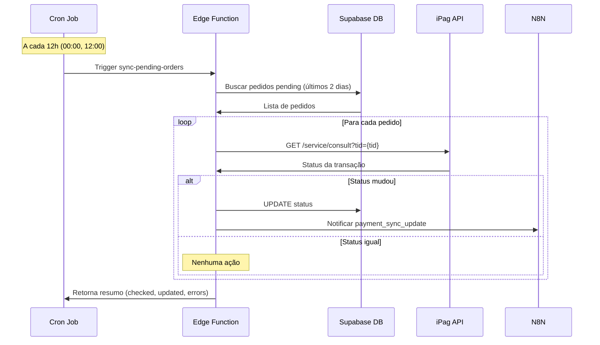

# 🔄 Sincronização Automática de Pedidos Pendentes

## Visão Geral

Sistema automático que consulta o iPag a cada 12 horas para verificar o status de pedidos pendentes, atualizando automaticamente quando o pagamento é confirmado.

## Como Funciona

### 1. Edge Function: `sync-orders`

**Localização:** `supabase/functions/sync-orders/index.ts`

**Função:**
- Busca pedidos com `status='pending'` criados nos últimos 2 dias
- Consulta o iPag API para cada pedido usando o ID (truncado para 16 chars)
- Atualiza o status no banco se houver mudança e salva o `ipag_transaction_id`
- Notifica o N8N sobre atualizações

**Lógica de Tempo:**
- ✅ Pedidos com até 2 dias: verificados
- 🔄 Execução a cada 12h = 4 verificações máximas por pedido

**Endpoint:** `https://rrgrkbjmoezpesqnjilk.supabase.co/functions/v1/sync-orders`

### 2. Cron Job (pg_cron)

**Agendamento:** A cada 12 horas (00:00 e 12:00)

**Configuração:** `schedule-cron.sql`

**Cron Expression:** `0 */12 * * *`

## Instalação

### Passo 1: Deploy das Edge Functions

```bash
cd /Users/luisguimaraes/.gemini/antigravity/scratch/patricia-elias-reseller-app

# Função de Sync (protegida por padrão, invocada via token no cron)
npx supabase functions deploy sync-orders --no-verify-jwt

# Webhook (PÚBLICO - Obrigatório usar --no-verify-jwt)
npx supabase functions deploy ipag-webhook --no-verify-jwt

# Processamento de Pagamento (PÚBLICO/FRONTEND)
npx supabase functions deploy process-payment --no-verify-jwt
```

### Passo 2: Configurar Variáveis de Ambiente

As seguintes variáveis já devem estar configuradas no `.env` do Supabase:
- `IPAG_API_ID`: `contato@patriciaelias.com.br`
- `IPAG_API_KEY`: `266C-AFC941C4-A7FC6FA1-2A1C78A7-0D35`
- `N8N_WEBHOOK_URL`

### Passo 3: Configurar Cron Job

**Via SQL Editor (Dashboard):**
1. Abra o arquivo `schedule-cron.sql`
2. Copie o conteúdo
3. Cole no SQL Editor do Supabase e execute
4. Verifique se deu sucesso

### Passo 4: Verificações

**Webhook do iPag:**
Deve ser acessível publicamente (sem token de Auth do Supabase):
```bash
curl -I -X POST https://rrgrkbjmoezpesqnjilk.supabase.co/functions/v1/ipag-webhook
# Deve retornar HTTP 400 (Bad Request) e NÃO 401 (Unauthorized)
```

## Testando

### Teste Manual da Edge Function de Sync

```bash
curl -X POST \
  https://rrgrkbjmoezpesqnjilk.supabase.co/functions/v1/sync-orders \
  -H "Authorization: Bearer <SUA_ANON_KEY>" \
  -H "Content-Type: application/json"
```

**Resposta Esperada:**
```json
{
  "success": true,
  "checked": 2,
  "updated": 1,
  "errors": 0
}
```

### Verificar Logs da Edge Function de Sync

```bash
npx supabase functions logs sync-orders --tail
```

### Verificar Execuções do Cron

```sql
-- Ver histórico de execuções
SELECT * FROM cron.job_run_details 
WHERE jobname = 'sync-orders-every-12h'
ORDER BY start_time DESC 
LIMIT 10;

-- Ver próximas execuções
SELECT * FROM cron.job 
WHERE jobname = 'sync-orders-every-12h';
```

## Fluxo Completo



## Mapeamento de Status iPag

| Código iPag | Mensagem | Status Interno |
|-------------|----------|----------------|
| 3, 8, 10 | approved, capturado, pago | `paid` |
| 4, 5, 7 | canceled, denied, recusado | `canceled` |
| 6 | refunded, estornado | `refunded` |
| 1, 2 | created, waiting | `pending` |

## Monitoramento

### Logs Importantes

**Edge Function:**
```
=== Sync Pending Orders - Started ===
Found 2 pending orders to check
Checking order ce987b93-4b03-44 - iPag TID: 10835996
Order ce987b93-4b03-44 - Status Code: 8, Message: capturado
Updating order ce987b93-4b03-44: pending -> paid
N8N notified for order ce987b93-4b03-44
=== Sync Complete: 1 updated, 0 errors ===
```

### Métricas

- **Pedidos Verificados:** Total de pedidos pending encontrados
- **Pedidos Atualizados:** Quantos mudaram de status
- **Erros:** Falhas na consulta ou atualização

## Troubleshooting

### Problema: Cron não executa

**Solução:**
```sql
-- Verificar se pg_cron está habilitado
SELECT * FROM pg_extension WHERE extname = 'pg_cron';

-- Verificar se o job está ativo
SELECT * FROM cron.job WHERE jobname = 'sync-pending-orders-job';

-- Recriar o job
SELECT cron.unschedule('sync-pending-orders-job');
SELECT cron.schedule(
  'sync-pending-orders-job',
  '0 0,12 * * *',
  $$SELECT trigger_sync_pending_orders()$$
);
```

### Problema: Edge Function retorna erro

**Verificar:**
1. Secrets estão configurados?
   ```bash
   npx supabase secrets list
   ```

2. Logs da função:
   ```bash
   npx supabase functions logs sync-pending-orders
   ```

3. Testar manualmente com curl

### Problema: iPag API retorna erro

**Possíveis causas:**
- TID inválido ou não encontrado
- Credenciais incorretas
- Limite de rate (120 req/min)

**Solução:**
- Verificar `ipag_transaction_id` no banco
- Validar `IPAG_API_ID` e `IPAG_API_KEY`
- Adicionar delay entre requisições se necessário

## Comandos Úteis

```bash
# Deploy da função
npx supabase functions deploy sync-pending-orders --no-verify-jwt

# Ver logs em tempo real
npx supabase functions logs sync-pending-orders --tail

# Testar localmente
npx supabase functions serve sync-pending-orders

# Executar teste manual
curl -X POST http://localhost:54321/functions/v1/sync-pending-orders
```

## Configurações Avançadas

### Alterar Frequência do Cron

```sql
-- A cada 6 horas
SELECT cron.schedule(
  'sync-pending-orders-job',
  '0 */6 * * *',
  $$SELECT trigger_sync_pending_orders()$$
);

-- A cada 24 horas (apenas à meia-noite)
SELECT cron.schedule(
  'sync-pending-orders-job',
  '0 0 * * *',
  $$SELECT trigger_sync_pending_orders()$$
);
```

### Alterar Janela de Tempo

Editar `sync-pending-orders/index.ts`:

```typescript
// De 2 dias para 3 dias
const threeDaysAgo = new Date()
threeDaysAgo.setDate(threeDaysAgo.getDate() - 3)

const { data: pendingOrders } = await supabase
    .from('orders')
    .select('*')
    .eq('status', 'pending')
    .gte('created_at', threeDaysAgo.toISOString())
```

## Notas Importantes

1. **Limite de Requisições:** iPag permite 120 req/min. Com 12h de intervalo, isso não será problema.
2. **Timeout:** Edge Functions têm timeout de 60s. Se houver muitos pedidos, considere processar em batches.
3. **Custos:** Cada execução do cron consome recursos. Com 2x/dia, o custo é mínimo.
4. **Redundância:** O webhook do iPag continua funcionando. Este cron é um backup.

---

**Criado em:** 31 de Janeiro de 2026  
**Versão:** 1.0.0
